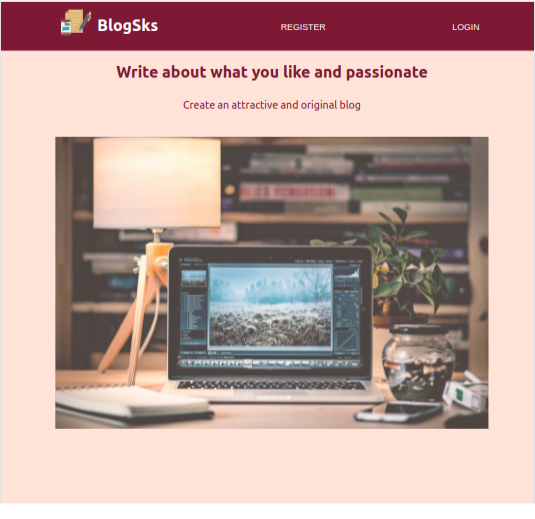
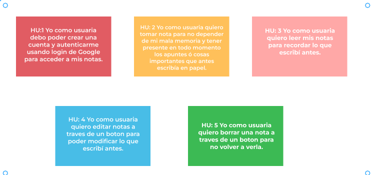
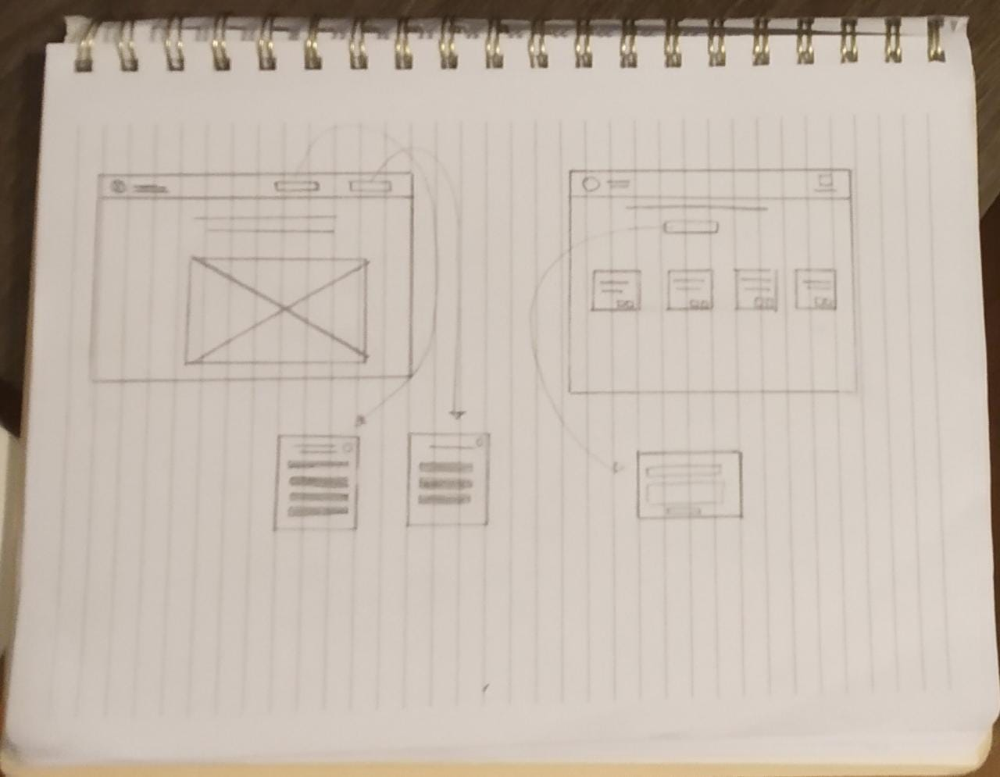
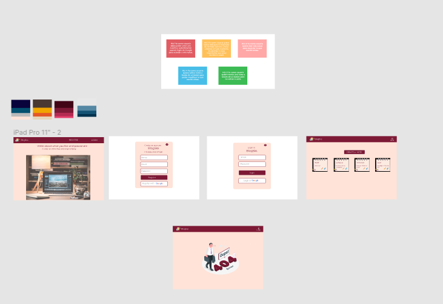
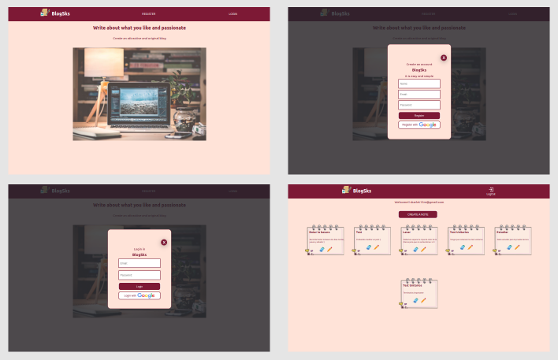
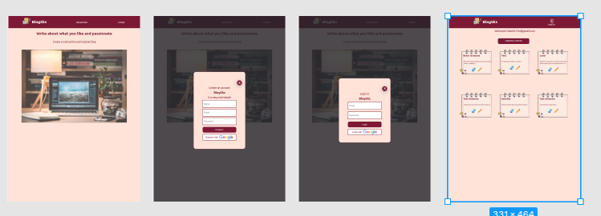
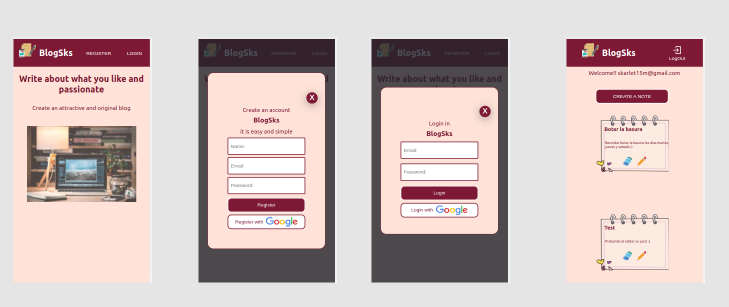

# LabNote BlogSks

## Índice

- [LabNote BlogSks](#labnote-blogsks)
  - [Índice](#índice)
  - [1. Resumen del proyecto](#1-resumen-del-proyecto)
  - [2. Experiencia UX](#2-experiencia-ux)
  - [3. Solución a los usuarios](#3-solución-a-los-usuarios)
  - [4. Prototipos](#4-prototipos)
    - [4.1 Baja fidelidad (Boceto)](#41-baja-fidelidad-boceto)
    - [4.2 Alta fidelidad (figma)](#42-alta-fidelidad-figma)
  - [5. Prototipo final](#5-prototipo-final)
    - [5.1 Desktop](#51-desktop)
    - [5.2 Tablet](#52-tablet)
    - [5.3 Mobile](#53-mobile)
  - [6. Tecnologías](#6-tecnologías)
    - [(Techs Skills)](#techs-skills)
  - [7. Conocimientos reforzados](#7-conocimientos-reforzados)
  - [7. Conocimientos reforzados](#7-conocimientos-reforzados-1)
  - [8. Conocimientos adquiridos](#8-conocimientos-adquiridos)
    - [EXTRAS](#extras)
  - [9. Habilidades blandas](#9-habilidades-blandas)
    - [(Life Skills)](#life-skills)
  - [10. Autor](#10-autor)
  - [11. Licencia](#11-licencia)

## 1. Resumen del proyecto

BlogSks es una pagina web en donde puedes ingresar como usuario y crear tu propio blog de notas, las cuales puedes visualizar, editar y eliminar

## 2. Experiencia UX

Esta pagina web esta relacionada con el usuario en donde puedes escribir sobre lo que te gusta y apasiona ta traves de notas.

BlogSks permitira al usuario crear una cuenta a traves de correo y contraseña, o inicio de sesion con google, y crear notas e interectuar con ellas, como:

- Escribirlas y publicarlas
- Editarlas
- Eliminarlas

¿Que problema resuelve?
Esta pagina te permite guardas notas de manera que puedas acceder a ellas cuando lo necesites y en cualquier momento que lo desees.
## 3. Solución a los usuarios

Las historias de usuario en las que se basa el proyecto para darle solución al problema, son las siguientes:

## 4. Prototipos
Para realizar dicho proyecto se llevó a cabo un prototipo de baja y alta fidelidad con el que se buscaba:

- Brindarle al usuario una interfaz fácil de comprender
- Un flujo de pantallas optimo y coherente
- Un prototipo que pudiera ser iterable, creativo y representativo del mundo Tech.

### 4.1 Baja fidelidad (Boceto)
- Aquí creamos el primer prototipo en papel el cual fue una guía de como quedaría la interfaz de acuerdo a componentes y elementos, y nuestro siguiente paso fue pedir feedback a otros usuarios para mejorar el prototipo.

 

### 4.2 Alta fidelidad (figma)
- Creamos un prototipo en Figma el cual representa de manera visual el producto final de la página, esta fue la base para que pudieramos comenzar a maquetar el sistema en HTML, CSS & JS y obtuvimos el siguiente feedback: agregar el boton de google para el registro, al guardar las notas cerrar el popup

  

## 5. Prototipo final

### 5.1 Desktop

### 5.2 Tablet

### 5.3 Mobile

## 6. Tecnologías
### (Techs Skills)
- [_Trello_](https://trello.com/b/PCPflINL/labnote)
- [_Figma_](https://www.figma.com/file/I1MjjCtLUU4wzCFopbSqcd/LabNotes?node-id=0%3A1)
- HTML
- CSS
- JS
- Firebase
- Jest

## 7. Conocimientos reforzados

🖥 Semantica (HTML)\
🖥 CSS (Flexbox CSS, CSS Grid)\
🖥 Box Model\
🖥 Responsive Web Design\
🖥 Uso de funciones\
🖥 Ciclos (ForEach)\
🖥 Condicionales (If)\
## 7. Conocimientos reforzados

🖥 Semantica (HTML)\
🖥 CSS (Flexbox CSS, CSS Grid)\
🖥 Box Model\
🖥 Responsive Web Design\
🖥 Uso de funciones\
🖥 Ciclos (ForEach)\
🖥 Condicionales (If)\
🖥 Uso de datos primitivos\
🖥 React\
🖥 Module CSS\
🖥 React Router Dom\
🖥 Stage\
🖥 JSX\
🖥 Manejo de Hooks\
🖥 Pruebas unitarias con Jest/testing library\
🖥 Firebase\

## 8. Conocimientos adquiridos

💻 Firebase \
💻 Autentication \
💻 Inicio de sesión con proveedores \
💻 Firestore \
💻 React \
💻 Ruteo SPA (Single Page Aplication) con react router dom\
💻 JSX \
💻 Stage \
💻 Hooks \
💻 Promesas \
💻 Module CSS \
💻 Git Project 

### EXTRAS

⌨ Conceptos de UI/UX\
⌨ Manejo de Figma\
⌨ Markdown

## 9. Habilidades blandas 
### (Life Skills)

🦾 Profesionalismo\
🦾 Autoaprendizaje\
🦾 Comunicación eficaz

## 10. Autor

👩🏼‍💻 SKARLET ARAQUE - https://github.com/SkarletA

## 11. Licencia

Este proyecto está bajo la Licencia de Skarlet Araque (BlogSks❤).